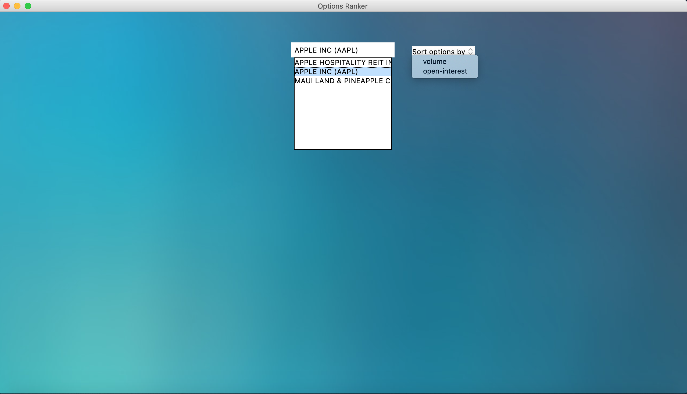
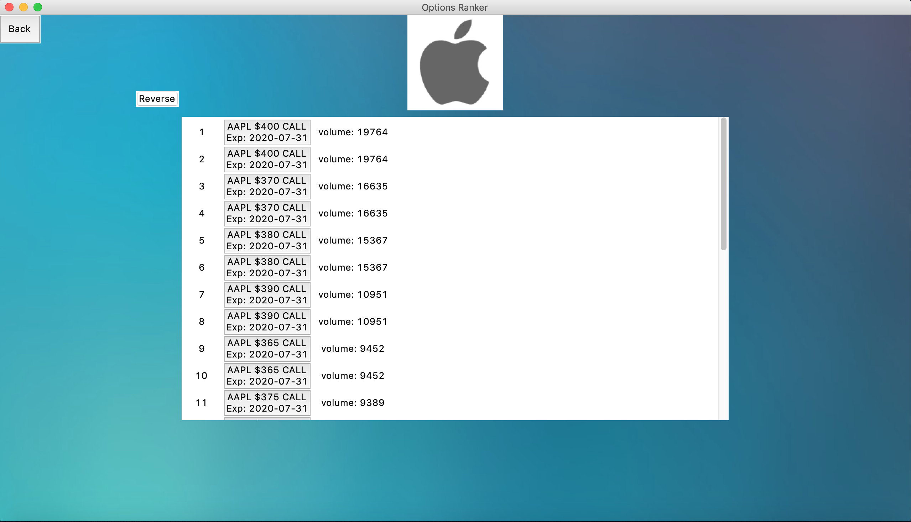
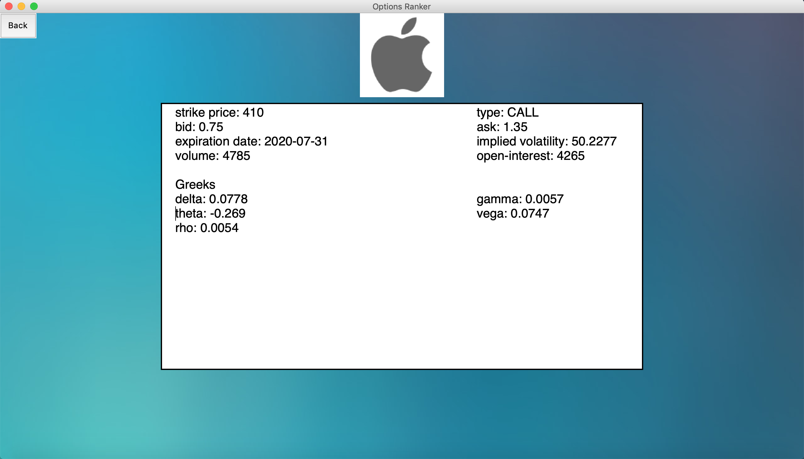

**Options Ranker**

When looking for specific Options Contracts to invest in it can often be useful to look at contracts with high volume or open interest. Liquidity is important for tight bid - ask spreads and can also be an indication for where people are putting their money, however, there can be hundreds of different Options contracts for a given stock and it can be incredibly time consuming to look through the contracts one by one. This project was made to ease the search for options contracts with high volume or open interest. 

How to use it:
* Download the repository
* run: ```python3 gui.py```

You can enter a ticker/company and choose from the companies suggested based on your imput, and then choose how you want the Options contracts to be sorted.

A list of 25 option contracts with the highest volume or open interest is displayed. Each contract is represented as a button that can be clicked and will redirect you to a new page that provides more details on that specific Options contract.


